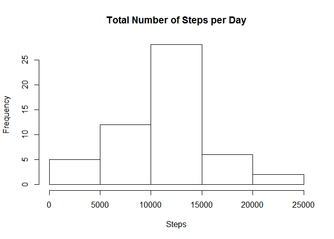
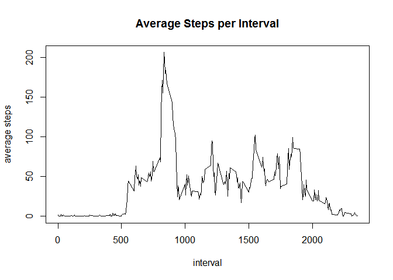
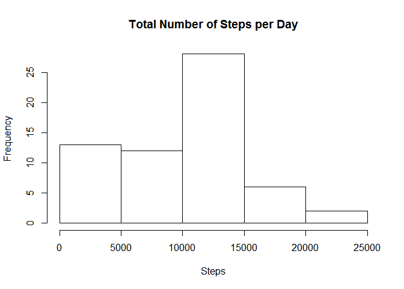
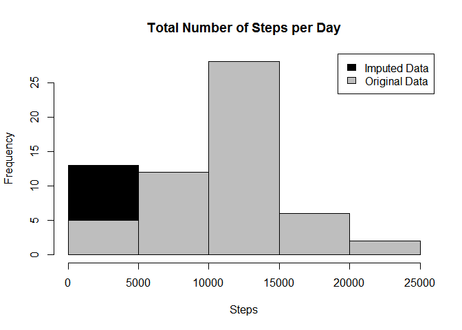
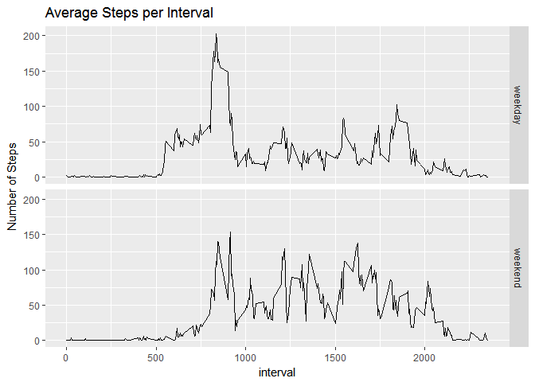

# Reproducible Research: Peer Assessment 1


## Loading and preprocessing the data

```r
activity <- read.csv("activity.csv")
head(activity)
```

```
##   steps       date interval
## 1    NA 2012-10-01        0
## 2    NA 2012-10-01        5
## 3    NA 2012-10-01       10
## 4    NA 2012-10-01       15
## 5    NA 2012-10-01       20
## 6    NA 2012-10-01       25
```

## What is mean total number of steps taken per day?

### 1. Calculate the total number of steps taken per day

```r
sumStep <- aggregate(steps~date, activity, sum)
head(sumStep)
```

```
##         date steps
## 1 2012-10-02   126
## 2 2012-10-03 11352
## 3 2012-10-04 12116
## 4 2012-10-05 13294
## 5 2012-10-06 15420
## 6 2012-10-07 11015
```
### 2. Make histogram of the total number of steps taken per day

```r
hist(sumStep$steps, xlab="Steps", main="Total Number of Steps per Day") 
```

<!-- -->

### 3. Calculate the mean and median of the total steps per day

```r
mean(sumStep$steps, na.rm = TRUE)
```

```
## [1] 10766.19
```

```r
median(sumStep$steps, na.rm = TRUE)
```

```
## [1] 10765
```
## What is the average daily activity pattern?
### 1. Make a time series plot of the interval and the average steps

```r
meanInterval <- aggregate(steps~interval, activity, mean)
plot(meanInterval, type="l", ylab="average steps", main="Average Steps per Interval")
```

<!-- -->

### 2. Find the 5-minute interval, contains the maximum average number of steps

```r
meanInterval[which.max(meanInterval$steps), "interval"]
```

```
## [1] 835
```

## Imputing missing values
### 1. Calculate and report the total number of missing values in the dataset

```r
naVector <- is.na(activity$steps)
sum(naVector)
```

```
## [1] 2304
```

### 2. Use the mean for that 5-minute interval to fill in all of the missing values in the dataset. 3. Create a new dataset that is equal to the original dataset but with the missing data filled in.

```r
fillNA <- activity
fillNA[naVector,"steps"] <- meanInterval[naVector%%2355, "steps"]
head(fillNA)
```

```
##      steps       date interval
## 1 1.716981 2012-10-01        0
## 2 1.716981 2012-10-01        5
## 3 1.716981 2012-10-01       10
## 4 1.716981 2012-10-01       15
## 5 1.716981 2012-10-01       20
## 6 1.716981 2012-10-01       25
```

```r
sum(is.na(fillNA$steps))
```

```
## [1] 0
```

### 4. Make a histogram of the total number of steps taken each day and Calculate and report the mean and median total number of steps taken per day. 

```r
sumStep2 <- aggregate(steps~date, fillNA, sum)
hist(sumStep2$steps, xlab="Steps", main="Total Number of Steps per Day") 
```

<!-- -->

```r
mean(sumStep2$steps, na.rm = TRUE)
```

```
## [1] 9419.081
```

```r
median(sumStep2$steps, na.rm = TRUE)
```

```
## [1] 10395
```

### Show difference of the result when imputing missing data.

```r
hist(sumStep2$steps, breaks=5, xlab="Steps", main = "Total Number of Steps per Day", col="Black")
hist(sumStep$steps, breaks=5, col="Grey", add=T)
legend("topright", c("Imputed Data", "Original Data"), fill=c("black", "grey") )
```

<!-- -->

## Are there differences in activity patterns between weekdays and weekends?
### 1. Create a new factor variable in the dataset with two levels - "weekday" and "weekend" indicating whether a given date is a weekday or weekend day.

```r
fillNA$day <- weekdays(as.Date(fillNA$date))
fillNA$day <- ifelse(fillNA$day %in% c("Saturday", "Sunday"), "weekend", "weekday")
```

### 2. Make a panel plot containing a time series plot (i.e. type = "l") of the 5-minute interval (x-axis) and the average number of steps taken, averaged across all weekday days or weekend days (y-axis). See the README file in the GitHub repository to see an example of what this plot should look like using simulated data.

```r
meanDay <- aggregate(steps~interval+day, fillNA, mean)
library(ggplot2)
g <- ggplot(meanDay, aes(interval, steps))
g + geom_line() + facet_grid(day~.) + labs(y="Number of Steps", title="Average Steps per Interval")
```

<!-- -->

